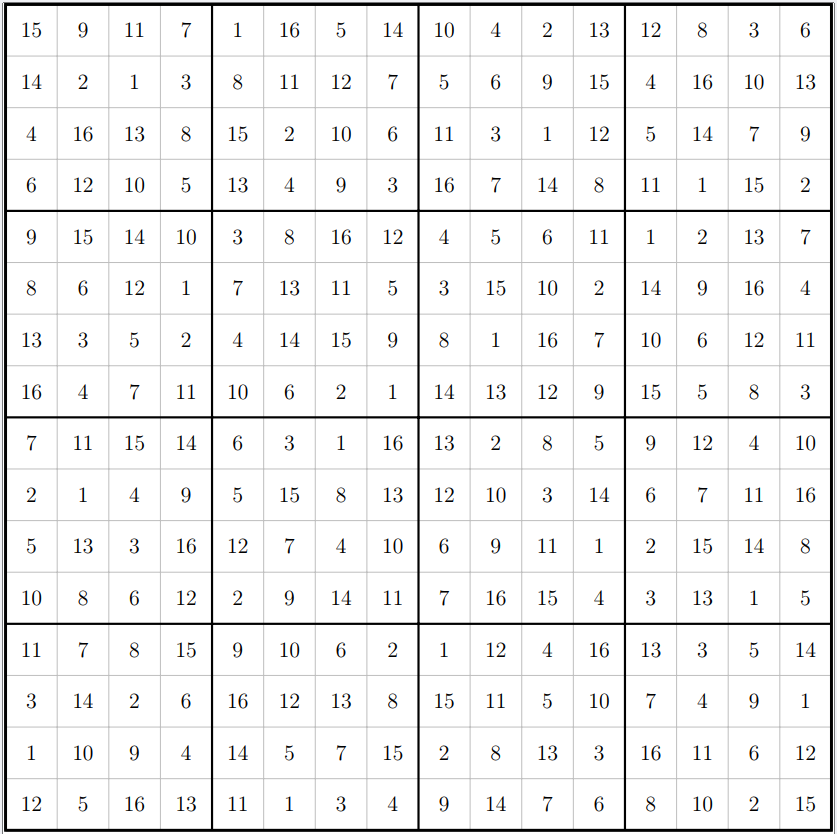

# Sudoku Game Toolkit
<div style="text-align: center;">
    
</div>


## Overview

This project provides a comprehensive suite of tools for Sudoku enthusiasts and developers alike. It includes functions for generating complete Sudoku solutions, crafting playable Sudoku puzzles from these solutions, and solving given Sudoku games. The toolkit is designed to be flexible, catering to both programmable and interactive needs.
One of the objectives is to study the effect of constraining the typical backtracking algorithm.

## Features

- **Solution Generator**: Creates a complete Sudoku solution using a backtracking algorithm, ensuring that each puzzle is solvable.
- **Game Generator**: Takes a full solution and strategically removes numbers to create a challenging yet solvable game.
- **Solver**: Implements a combination of strategies for solving Sudoku puzzles, including backtracking, naked singles, and hidden pairs.
- **Export Utilities**: Tools to export Sudoku games to various formats such as CSV for easy sharing and HTML for presentation.

## Usage

Each module in the toolkit can be used independently or in combination to generate, solve, or export Sudoku games. Below are the main components and their intended usage:

### Generating a Sudoku Solution

```python
solution = generate_solution()

# Generating a Game from a Solution
game = make_game_from_solution(solution)

# Solving a Sudoku Game
solved_game = solve(game)

# Exporting a Game as HTML or LaTex
export_board_to_html(game, 'output.html')

```

## Contributing
Contributions to the project are welcome. You can contribute by improving the algorithms, adding new features, or simply documenting the code more thoroughly.

